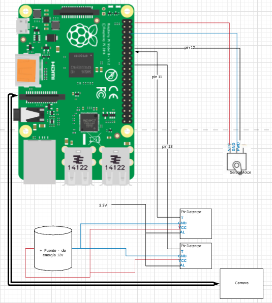

# SistemaDeSeguridad
2019
----

# Descripción:

    Sistema de vigilancia

Controlador para sistema de vigilancia. Envio de notificaciones, videos/imágenes a una aplicación movil cuando se detecta algún movimiento.
El controlador esta compuesto de los siguientes componentes:
* Raspberry pi .- se encarga de controlar todos los sensores y el envió de datos a través de wifi.
* PIR - dectector.- este sensor permitirá conocer si existe algún movimiento en su rango de visión. Por cada nodo se necesitará un total de 2 sensores de este tipo para tener un rango completo de visión.  
* Servo motor. - su función es mover la cámara de acuerdo a la región donde exista movimiento para la toma de fotos en dicha región. 
* Módulo de cámara. - este sensor solo tomará fotos/videos cuando exista algún movimiento. 

# Implementación

1. Esquema.

2. Ejecutar el siguiente script
´´´
    cd raspController
    ./build.sh
´´´

3. Ejecutar el siguiente script
´´´
    cd raspController
    python controlador.py
´´´

----------------------------------
### Autor ###
* Mauricio Leiton Lázaro [github](https://github.com/mdleiton)